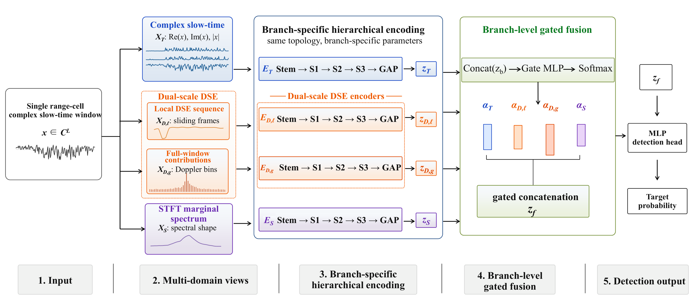

# HiMTS-Net

Official implementation of **HiMTS-Net: A Native-Axis-Preserving Hierarchical
Multi-Domain Time--Spectral Network for Small Target Detection in Sea
Clutter**.

**Authors:** Fulun Miao, Quanhua Liu, Huayu Fan, Yi Liu, Yuanshuai Li, Guanqun Wang, and Baogui Qi<br>
The manuscript associated with this repository is currently under review.

## Overview

HiMTS-Net is a compact multi-domain network for detecting small floating
targets in sea clutter. Instead of converting radar echoes into rasterized
time--frequency images, the method keeps each representation on its native
physical axis and learns complementary information with four branch-specific
hierarchical 1D encoders. A sample-adaptive gate then fuses the branch
embeddings for binary target detection.



*Overall framework of HiMTS-Net. A complex slow-time window is transformed
into four time--spectral representations, encoded independently, and combined
by adaptive feature-level fusion.*

### Highlights

- Four complementary inputs: complex slow-time components, local DSE,
  full-window entropy contribution, and spectral marginal spectrum (SMS).
- Native-axis-preserving 1D processing without image resizing or
  interpolation.
- Hierarchical residual encoders with increasing temporal/spectral receptive
  fields.
- Sample-adaptive gated fusion across the four representation branches.
- 200,613 trainable parameters with the default hidden dimension of 32.

## Repository contents

```text
HiMTS-Net/
|-- assets/
|   `-- method_overview.png       # Method overview from the manuscript
|-- configs/
|   |-- ipix.yaml                 # IPIX experiment configuration
|   `-- sdrdsp2022.yaml           # SDRDSP2022 experiment configuration
|-- src/himts_net/
|   |-- data_ipix.py              # IPIX loading, labeling, and splitting
|   |-- data_sdrdsp2022.py        # SDRDSP2022 loading and splitting
|   |-- evaluation.py             # Held-out test-set evaluation
|   |-- features.py               # Four input representations
|   |-- model.py                  # HiMTS-Net architecture
|   |-- runner.py                 # Dataset-to-training orchestration
|   `-- training.py               # Optimization and checkpoint selection
|-- train.py                      # Command-line entry point
|-- test.py                       # Held-out test entry point
|-- requirements.txt
`-- pyproject.toml
```

## Installation

Python 3.10 or newer is required. The dependency file specifies PyTorch 2.7.1
and the numerical packages used by the implementation.

```bash
git clone https://github.com/3220250895/HiMTS-Net.git
cd HiMTS-Net
python -m pip install -r requirements.txt
python -m pip install -e .
```

The supplied configurations use `device: cuda`. Change this field to `cpu` if
a CUDA-enabled PyTorch environment is unavailable.

## Data preparation

Obtain the datasets under their respective terms from the
[McMaster IPIX database](http://soma.ece.mcmaster.ca/ipix/dartmouth/datasets.html)
and the [Journal of Radars sea-detecting dataset (2022)](https://radars.ac.cn/web/data/getData?newsColumnId=cbfe5177-6bdd-4a9e-a05e-63b2e50ea438&pageType=en).

Arrange the files as follows:

```text
data/
|-- ipix/
|   |-- 19931118_023604_starea280.cdf
|   |-- 19931107_135603_starea17.cdf
|   `-- ...                       # Ten IPIX files listed in data_ipix.py
`-- sdrdsp2022/
    |-- 20221114140049_stare_HH.mat
    |-- 20221114220100_stare_HH.mat
    |-- 20221113190042_stare_HH.mat
    |-- 20221113230100_stare_HH.mat
    |-- 20221112205109_stare_HH.mat
    `-- 20221112180016_stare_HH.mat
```

### Expected formats

| Dataset | Expected content | Windowing | Training/validation data |
| --- | --- | --- | --- |
| IPIX | NetCDF `.cdf`, variable `adc_data`; HH/HV/VH/VV channels | 512 pulses, stride 32 | Stratified random split: 56% training / 14% validation / 30% test |
| SDRDSP2022 | HDF5-based `.mat`, matrix `amplitude_complex_T1` | 1024 pulses; target stride 200, clutter stride 1024 | Chronological split: first 70% training / next 15% validation / final 15% test |

For IPIX, the primary target range bin is labeled positive, documented
target-affected neighboring bins are excluded, and the remaining range bins
provide clutter samples. For SDRDSP2022, the target and observation cells used
by the manuscript are defined explicitly in `data_sdrdsp2022.py`.

## Usage

Run an IPIX experiment:

```bash
python train.py --config configs/ipix.yaml
```

Run an SDRDSP2022 experiment:

```bash
python train.py --config configs/sdrdsp2022.yaml
```

After training, evaluate the selected checkpoint on the held-out test split:

```bash
python test.py --config configs/ipix.yaml
python test.py --config configs/sdrdsp2022.yaml
```

The test command determines the detection threshold from test-set clutter at
the configured target `Pfa`, following the paper protocol. It reports `Pd`,
the realized `Pfa`, and ROC AUC.

The default output directories are `outputs/ipix/` and
`outputs/sdrdsp2022/`. The training and test commands create:

- `model.pt`: the selected model state and training configuration;
- `normalizer.npz`: normalization statistics fitted on the training split;
- `history.json`: per-epoch training and validation history;
- `test_metrics.json`: held-out test metrics and ROC coordinates, created by
  `test.py`.

Generated files are ignored by Git.

## Default configuration

| Setting | Value |
| --- | ---: |
| Hidden dimension | 32 |
| Encoder kernels | 15, 21, 31 |
| Residual blocks per stage | 2 |
| Optimizer | AdamW |
| Learning rate | 1e-3 |
| Batch size | 256 |
| Epochs | 30 |
| Hard-negative fraction | 0.25 |
| Model-selection operating point | Pfa = 1e-3 |
| Random seed | 42 |

Dataset paths, selected records, window parameters, and computing device can
be changed in the YAML files under `configs/`.

## Citation

If this repository is useful in your research, please cite the accompanying
manuscript:

```bibtex
@misc{miao2026himtsnet,
  title  = {HiMTS-Net: A Native-Axis-Preserving Hierarchical Multi-Domain
            Time--Spectral Network for Small Target Detection in Sea Clutter},
  author = {Fulun Miao and Guanqun Wang},
  year   = {2026},
  note   = {Manuscript}
}
```

The citation will be updated when a public paper record becomes available.

## License

This project is released under the [MIT License](LICENSE).

## Contact

For questions about the implementation, please open a
[GitHub issue](https://github.com/3220250895/HiMTS-Net/issues).
